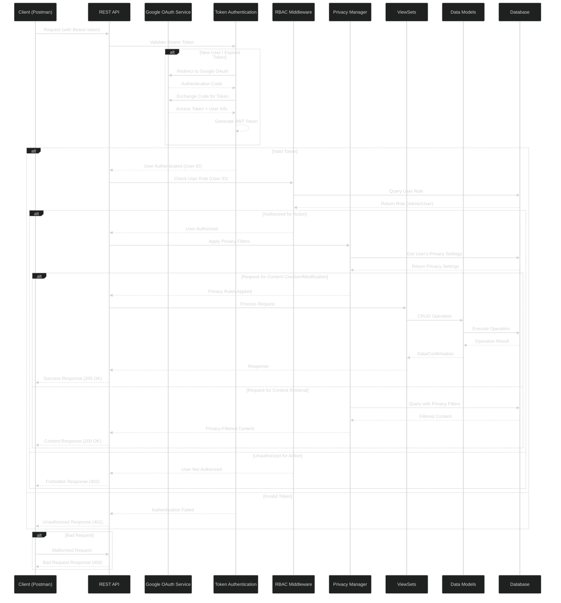
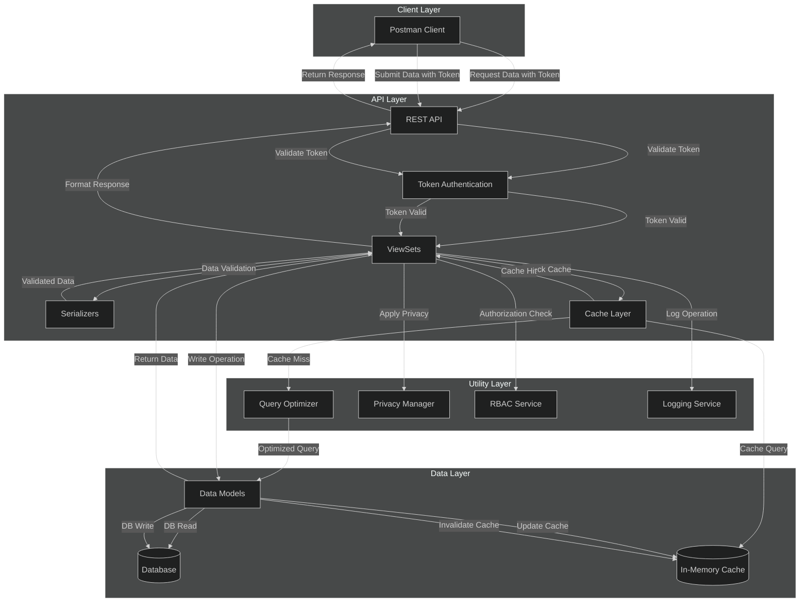

# Secure Social App Backend

A robust, secure backend architecture for a social media application with comprehensive access control, performance optimization, and modular design.

## Overview

This project implements a secure backend for a social media application that allows users to create posts, share content, comment, and engage with others' content. The system is built with security, performance, and scalability as primary concerns.

Key features include:
- Role-based access control (RBAC)
- Google OAuth authentication with token-based security
- Factory pattern for handling different post types
- Privacy settings management
- Performance optimizations with caching and query optimization
- Comprehensive logging

## Architecture

The application follows a layered architecture design with clear separation of concerns:

### System Architecture

```mermaid
  graph TD
    %% External Components
    Client[Postman Client] -->|API Requests| API
    
    %% API Layer
    subgraph "API Layer" ["API Layer"]
        API[REST API]
        ViewSets[ViewSets]
        Serializers[Serializers]
        API --> ViewSets
        ViewSets --> Serializers
        GoogleOAuth[Google OAuth Service]
        API ---|Authentication| GoogleOAuth
        
        TokenAuth[Token Authentication]
        API -->|Verify Token| TokenAuth
        GoogleOAuth -->|Generate Token| TokenAuth
        
        RBACMiddleware[RBAC Middleware]
        API -->|Authorization Check| RBACMiddleware
        
        CacheLayer[Cache Layer]
        API -->|Optimized Responses| CacheLayer
    end
    
    %% Core Services
    subgraph "Core Services" ["Core Services"]
        Logger[Logging Singleton] 
        ViewSets --> Logger
        
        PostFactory[Post Factory]
        ViewSets -->|Create Posts| PostFactory
        
        PasswordService[Password Service]
        ViewSets -->|User Operations| PasswordService
        
        PrivacyManager[Privacy Settings Manager]
        ViewSets -->|Content Visibility| PrivacyManager
        
        QueryOptimizer[Query Optimizer]
        ViewSets -->|Efficient Queries| QueryOptimizer
    end
    
    %% Post Factory Implementation
    subgraph "Post Factory" ["Post Factory"]
        PostFactory --> TextPostCreator[Text Post Creator]
        PostFactory --> ImagePostCreator[Image Post Creator]
        PostFactory --> VideoPostCreator[Video Post Creator]
        
        MetadataValidator[Metadata Validator]
        TextPostCreator --> MetadataValidator
        ImagePostCreator --> MetadataValidator
        VideoPostCreator --> MetadataValidator
    end
    
    %% Data Models
    subgraph "Data Models" ["Data Models"]
        UserModel[User Model]
        PostModel[Post Model]
        CommentModel[Comment Model]
        LikeModel[Like Model]
        RoleModel[Role Model]
        PrivacySettingsModel[Privacy Settings Model]
        
        ViewSets -->|CRUD Operations| UserModel
        ViewSets -->|CRUD Operations| PostModel
        ViewSets -->|CRUD Operations| CommentModel
        ViewSets -->|CRUD Operations| LikeModel
        RBACMiddleware -->|Check Permissions| RoleModel
        PrivacyManager -->|Apply Settings| PrivacySettingsModel
    end
    
    %% Database
    Database[(Database)]
    UserModel --> Database
    PostModel --> Database
    CommentModel --> Database
    LikeModel --> Database
    RoleModel --> Database
    PrivacySettingsModel --> Database
    
    %% Caching System
    InMemoryCache[(In-Memory Cache)]
    CacheLayer --> InMemoryCache
    QueryOptimizer -->|Cache Strategy| InMemoryCache
    
    %% Password Handling
    PasswordService -->|Store Hashed| Database
    PasswordService -->|Retrieve Hashed| Database
    
    %% Logging
    Logger -->|Log Events| LogStorage[(Log Storage)]
    
    %% Style Definitions
    classDef external fill:#a75cff,stroke:#ffffff,stroke-width:2px,color:#ffffff;
    classDef service fill:#5c73ff,stroke:#ffffff,stroke-width:1px,color:#ffffff;
    classDef factory fill:#5cff73,stroke:#ffffff,stroke-width:1px,color:#000000;
    classDef database fill:#ff5c73,stroke:#ffffff,stroke-width:1px,color:#ffffff;
    classDef security fill:#ffb55c,stroke:#ffffff,stroke-width:1px,color:#000000;
    classDef optimization fill:#5cffff,stroke:#ffffff,stroke-width:1px,color:#000000;
    
    class Client external;
    class API,ViewSets,GoogleOAuth service;
    class PostFactory,TextPostCreator,ImagePostCreator,VideoPostCreator,MetadataValidator factory;
    class Database,LogStorage,InMemoryCache database;
    class RBACMiddleware,PrivacyManager,PasswordService security;
    class CacheLayer,QueryOptimizer optimization;
```

The system architecture consists of several layers:

#### API Layer
- REST API for client interactions
- Google OAuth service for authentication
- Token authentication for session management
- RBAC middleware for authorization
- Cache layer for optimized responses
- Serializers for data validation and transformation

#### Core Services
- Logging singleton for centralized event tracking
- Post factory for different post types
- Password service for secure credential management
- Privacy settings manager for content visibility
- Query optimizer for database efficiency

#### Data Models
- User model
- Post model with various post types
- Comment and Like models for engagement
- Role model for access control
- Privacy settings model for user preferences

### Access Control Flow

The sequence diagram illustrates the request lifecycle with access control:

1. Client sends request with bearer token
2. Token authentication validates credentials
3. RBAC middleware checks user roles and permissions
4. Privacy manager applies content visibility rules
5. ViewSets process the validated request

### CRUD Operations Flow

The CRUD flow diagram demonstrates how data operations move through the system with optimizations:

- **Client Layer**: Entry point via Postman client
- **API Layer**: Request routing, token validation, and caching
- **Utility Layer**: Role checking, privacy management, query optimization
- **Data Layer**: Data models, database storage, and in-memory cache

## Technologies Used

- Python
- Django REST Framework
- Google OAuth 2.0
- JWT for token-based authentication
- In-memory caching
- PostgreSQL database (or your database of choice)

## Design Patterns

The application implements several design patterns:

1. **Factory Pattern**: For creating different types of posts
2. **Singleton Pattern**: For centralized logging
3. **Repository Pattern**: For data access abstraction
4. **Strategy Pattern**: For query optimization
5. **Decorator Pattern**: For RBAC middleware

## Setup and Installation

### Prerequisites
- Python 3.8+
- pip
- Virtual environment (recommended)
